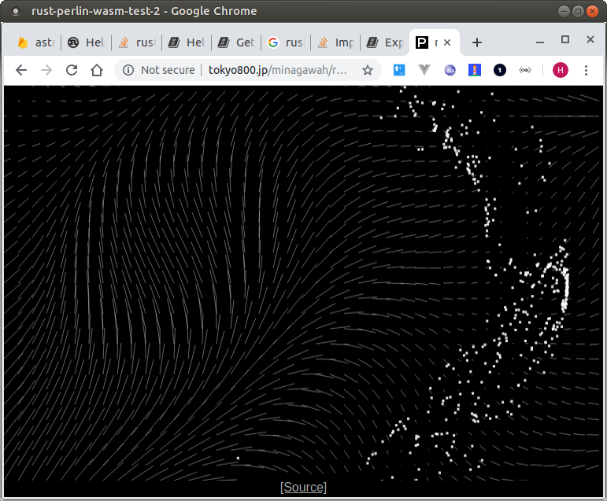

# rust-perlin-wasm-test-2

Using wasm-pack to play with Perlin noise.


[1. About](#about)  
[2. What I did](#what)  
[3. Run](#run)  
[4. Notes](#notes)  
&nbsp; [4-1. MIME TYPE](#notes-mime)  
[5. LICENSE](#license)  


**&gt;&gt;&gt; Work in Progress: Still haven't added `web-sys`, `js-sys`, and `futures`.**


<a id="about"></a>
## 1. About

[View Demo](http://tokyo800.jp/minagawah/rust-perlin-wasm-test-2/)



While [the previous sample](https://github.com/minagawah/rust-perlin-wasm-test)
used `nightly` toolchain to build `*.wasm` without much effort.
This time, I used [wasm-pack](https://github.com/rustwasm/wasm-pack)
(via [@wasm-tool/wasm-pack-plugin](https://github.com/wasm-tool/wasm-pack-plugin))
to bridge between WASM and NPM.

As you visit [wasm-pack](https://github.com/rustwasm/wasm-pack) website,
the official document gives you 2 options to either use
[rust-webpack](https://github.com/rustwasm/rust-webpack-template)
or
[wasm-app](https://github.com/rustwasm/create-wasm-app),
where they differ slightly in its features and of how they manage projects:

### (a) [wasm-app](https://github.com/rustwasm/create-wasm-app)
- JS sources managed in `src`.
- Needs to prepare your own Cargo under the root directory.
- Starts with `bootstrap.js` and asynchronously imports all the others.
- Uses `copy-webpack-plugin` to copy `index.html` to `dist`.

### (b) [rust-webpack](https://github.com/rustwasm/rust-webpack-template)
- JS sources managed in `js` and Rust in `src`.
- Already has `web-sys`, `js-sys`, and `futures` setups.
- Uses `wasm-pack-plugin` to build Cargo, and builds to right under the root.
- The generated `pkg/index.js` bridges to `*.wasm`, and no need for `bootstrap.js` (as it does in `wasm-pack`) to worry free of asynchronous issues.


```
# Try it yourself
npm init wasm-app a1;
npm init rust-webpack a2;
```

However, I want good parts from both,
so I decided to go with my own (I mean, for the Webpack setups).  
Here is the idea:

1. Git clone `rust-perlin-wasm-test-2` which I created on Github.
2. Use `wasm-pack-plugin`, so that worries nothing about asynchronous issues (no `bootstrap.js`).
3. Use `cargo-generate` to create my own Cargo project under the root directory.
4. Use `html-webpack-plugin` (and other handy Webpack plugins) to dynamically generates all the HTMNL (or CSS).
5. Add supports for `web-sys`, `js-sys`, and `futures`.


<a id="what"></a>
## 2. What I did

Here's what I actually did.  
Of course, you need basic tools (Ex. `npm`, `rustup`, etc.)  
You also need [wasm-pack](https://rustwasm.github.io/wasm-pack/installer/).

For NPM:

```
# Git clone `rust-perlin-wasm-test-2` which I created on Github.
git clone https://github.com/minagawah/rust-perlin-wasm-test-2.git;

# Installed minimum required NPM packages for Webpack + TypeScript + WASM
yarn add typescript webpack webpack-cli webpack-dev-server ts-loader html-webpack-plugin @wasm-tool/wasm-pack-plugin --dev

# For Webpack config files merging
yarn add webpack-merge --dev

# For ESLint on TypeScript
yarn add eslint @typescript-eslint/parser @typescript-eslint/eslint-plugin --dev

# For `tape` test on TypeScript
yarn global add ts-node
yarn add tape @types/tape --dev

# Copying `assets`
yarn add copy-webpack-plugin --dev

# Cleaning the previously built in `dist`
yarn add clean-webpack-plugin --dev

# Extract LICENSE information from `vender.js`
yarn add license-webpack-plugin --dev

# For CSS files (`style-loader` is for `dev`)
yarn add style-loader css-loader postcss-loader autoprefixer mini-css-extract-plugin --dev

# For Fonts & Image files
yarn add file-loader --dev

# So, it looks like this:
yarn add typescript webpack webpack-cli webpack-dev-server ts-loader html-webpack-plugin @wasm-tool/wasm-pack-plugin webpack-merge eslint @typescript-eslint/parser @typescript-eslint/eslint-plugin tape @types/tape copy-webpack-plugin clean-webpack-plugin license-webpack-plugin style-loader css-loader postcss-loader autoprefixer mini-css-extract-plugin file-loader --dev

# For service use.
yarn add debounce-ctx
```

For Cargo:

```
# Use `cargo-generate` to create a new Cargo project (called `wasm-noise`)
cd rust-perlin-wasm-test-2
cargo generate --git https://github.com/rustwasm/wasm-pack-template --name wasm-noise

# Modifiy some files a bit
cd wasm-noise
rm -fR .git
rm -f LICENSE_APACHE
mv LICENSE_MIT LICENSE
vi .gitignore
-----------------------
# wasm-pack related
bin/
pkg/
wasm-pack.log
-----------------------


vi Cargo.toml
--------------------------------------------------
14c14,15
< wasm-bindgen = "0.2"
---
> wasm-bindgen = "^0.2"
> noise = "0.5.1"
30c31,37
< wasm-bindgen-test = "0.2"
---
> wasm-bindgen-test = "^0.2"
> 
> [profile.dev]
> # Optimizing for dev (link-time-optimization).
> lto = true
> # We want speed rather than file size.
> opt-level = 3
34a42,43
> # Optimizing for release (link-time-optimization).
> lto = true
--------------------------------------------------

cargo build
```


<a id="run"></a>
## 3. Run

```
# dev
yarn serve

# prod
yarn build
```


<a id="notes"></a>
## 4. Notes


<a id="notes-mime"></a>
## 4-1. MIME TYPE

Simply uploading WASM file to the remote server won't work.  
Your server must send a MIME header specific to the WASM file.  
SSH your hosting server and simply set to `.htaccess`:

```
AddType application/wasm .wasm
```


<a id="license"></a>
## 5. License

Provided under [WTFPL](./LICENSE).  
Remember, there are some NPM libraries that are under certain license restrictions.  
Build the project, and `license-webpack-plugin` extracts license information,
and you can see them in separate files under `dist`.

